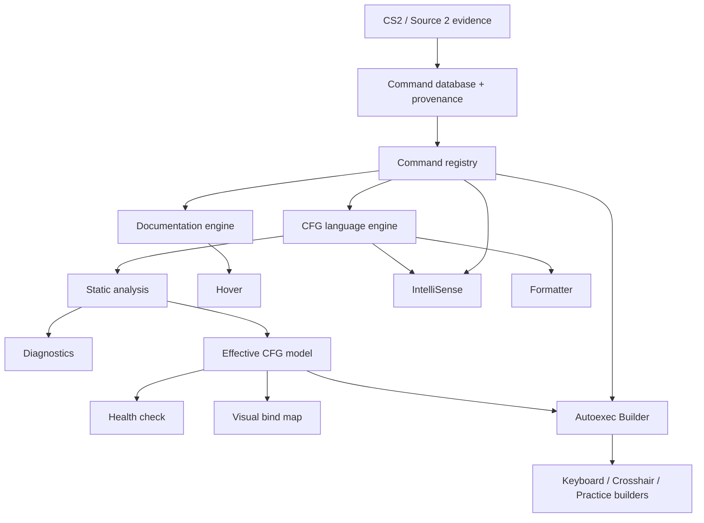

# Architecture

The [project vision](../PROJECT_VISION.md) defines the direction. The folder map below describes the current implementation; the shared-domain architecture later in this document is the target. See the [audit](planning/architecture-audit.md) for gaps. Add modules as responsibilities become real rather than creating every folder from the master specification.

CS2 Config Tools separates language behavior from editor integration. This keeps formatting and parsing easy to test and makes the project approachable without a monorepo or a language server.

```text
src/
  extension.ts           Activation only
  core/                  Parser, context, diagnostics, locale and formatter
  catalog/               TypeScript catalog types
  vscode/                Providers, shared document cache and UI adapters
catalog/
  source/                Editable descriptions, inventory and console evidence
  catalog.json           Generated catalog shipped with the extension
resources/               Grammar and language configuration
scripts/                 Catalog generation and editor integration runner
tests/
  unit/                  Core and formatter behavior
  integration/           Real VS Code provider checks
  fixtures/              Reference CFGs
docs/
  planning/              Roadmap, initial scope and current status
artifacts/               Generated VSIX packages; ignored by Git
```

The VS Code manifest and its localization files stay at the root, alongside the main README, contribution guide and project configuration. Those are the entry points expected by the tooling and by contributors.

## Data flow

Editor text is parsed into statements with source offsets. Nested bind/alias command strings retain offsets into the original document. Providers share a cache keyed by URI and document version; closing a document evicts it. Diagnostics are debounced, while hover and completion use the latest cached parse.

The formatter is a pure function. It scans physical lines and changes whitespace outside quoted text. It does not evaluate variables, execute aliases, reorder statements or normalize command values. Selection formatting expands to complete lines. Document formatting follows the editor's newline style and project formatting settings.

The catalog generator combines editable English/pt-BR descriptions with observed examples and console evidence. It validates required translations and can check reproducibility without rewriting the output. Its version follows `package.json`, so contributors do not maintain it in multiple places.

The current grammar treats quoted contents as literal. Escape rules, runtime context, original help text and parameter constraints need evidence before being expanded. Oversized files skip expensive provider analysis. A language server can be considered later if measured costs justify it.

## Packaging and tests

`dist/` contains compiled JavaScript and `artifacts/` contains VSIX packages. Both are generated. `.vscodeignore` excludes source code, personal fixtures, raw catalog evidence, planning documents and test profiles from the package.

Core tests run with Node's built-in runner. Integration tests call VS Code's providers in a separate Extension Development Host. Formatting tests compare command streams before and after formatting and check idempotence, literals, comments, newline styles and incomplete input.

The providers use the official [VS Code language API](https://code.visualstudio.com/api/language-extensions/programmatic-language-features). There are no runtime npm dependencies.

## Shared-domain target



Formatter behavior depends on source structure, not evaluated state. Builders submit structured actions to shared validation and source-writing services. They do not maintain a second parser or command database.

| Component            | Responsibility                                                                                              |
| -------------------- | ----------------------------------------------------------------------------------------------------------- |
| Registry             | Indexed immutable lookup, parameters, reviewed action semantics, lifecycle and evidence; no VS Code imports |
| Language engine      | Incomplete-text recovery, located syntax and nested relationships; retained trivia added incrementally      |
| Documentation engine | Shared facts and localized text; VS Code adapter renders Markdown                                           |
| Static analysis      | Symbol resolution, known constraints, stable finding codes, evidence and explicit partial results           |
| Effective model      | Ordered assignments, binds/unbinds, aliases and history with locations and certainty                        |
| Source writer        | Shared validation, serialization and localized edits that preserve unrelated content                        |

`src/catalog/registry.ts` now owns indexed lookup and normal/advanced visibility. Editor services expose that shared lookup and the complete symbol name set. The complete ConVar/command snapshot is promoted through a separate reviewed pipeline; field provenance keeps technical facts distinct from human explanations. Action semantics and full runtime-context modeling remain future work.

The statement parser now retains the original source, trivia and parent offsets for deferred bodies; it is not a full CST. `src/core/documentation.ts` produces render-independent blocks. `src/core/effective.ts` supplies a bounded single-file model with history and explicit unresolved effects, cached alongside document parsing. Parameter checks, local navigation, optional inlays and the textual health check consume shared domain services.

The model describes the supported static subset, not the running game. Unknown effects invalidate certainty of prior tracked values; later explicit literal writes can restore certainty for their own symbol. External execs remain unresolved. Preserve these limits while expanding analysis; future source writing still needs stronger round-trip guarantees.

Bind changes are recorded at the time of a certain write in `effective.ts`. Snapshot copies preserve the historical comparison even if later effects make final state uncertain. Resets clear the active comparison; unknown effects suppress comparisons against uncertain prior values. Alias execution carries the outer invocation location alongside the definition location. `core/binds.ts` converts these changes into shared findings used by editor diagnostics and health; clients do not infer conflicts from a flat statement list. Repetition means identical literal action text, not proven runtime equivalence. Key spelling is retained without inferred normalization.

Bind bodies are deferred, and declaring an alias does not execute it. Unknown actions, toggles, dynamic aliases and unresolved files cannot be reduced to unconditional last-assignment-wins behavior. Establish single-file effective state before visual tools; later workspace graph analysis extends the same model.

Keep original game help separate from community summaries. Show known parameter meanings concisely, omit unsupported defaults/ranges, and provide detailed provenance separately. Do not repeat the current assignment as a supposedly distinct explanatory example.

## Adapter and future UI boundaries

Providers adapt domain results to editor APIs and configuration. As semantic caches grow, include registry revision and relevant settings in invalidation. Workspace resolvers distinguish missing, inaccessible and unsupported targets. Dependency analysis needs cancellation, cycle detection, recursion/file budgets and partial-result reporting.

Keep existing `cs2Config.*` settings compatible. New commands/settings require a usable implementation; prefix changes require migration. Measure costs before adding incremental complexity or adopting a language server. Network requests remain outside editing.

Start visual work with a read-only bind map. Builders use registry-backed structured actions, shared validation and previews. WebView messages require typed host validation, restrictive CSP, scoped local resources, escaped content, keyboard navigation and accessible focus. Domain rules stay outside WebViews.

The read-only map now projects `effective.ts` through `core/bind-map.ts`; it does not parse or interpret actions in the UI. `vscode/bind-map.ts` pins the panel to the selected CFG, sends versioned snapshots, debounces edits and validates navigation against host-owned locations and the current document version. Closing the source clears the map. `resources/webview/` contains the reference layout and DOM renderer; literal data is assigned with `textContent`, scripts require a nonce, and only this asset directory is accessible. See the [VS Code WebView guidance](https://code.visualstudio.com/api/extension-guides/webview). No editing messages or runtime dependencies are added.

Each outgoing snapshot has a host-generated sequence ID, so navigation cannot be reused across documents with equal version numbers. After asynchronous editor opening, the adapter rechecks the source identity, document version and panel identity. The renderer uses stable key-based focus IDs, resets selection on source switches and renders a textual certainty legend. A standalone Chromium smoke runner reuses the production HTML/assets with a simulated bridge; it complements rather than replaces real Extension Host tests.

Formatting, cleanup and migration remain distinct operations. Existing-file updates preserve unsupported content and preview changes; new-file generation also passes through shared parsing and validation. See [database contracts](command-database.md), [evidence rules](data-sources.md) and [implementation phases](planning/implementation-plan.md).
