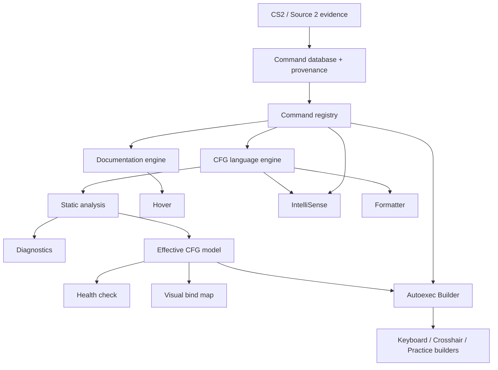

# Architecture

The [project vision](../PROJECT_VISION.md) defines the direction. The folder map below describes the current implementation; the shared-domain architecture later in this document is the target. See the [audit](planning/architecture-audit.md) for gaps. Add modules as responsibilities become real rather than creating every folder from the master specification.

CS2 Config Tools separates language behavior from editor integration. This keeps formatting and parsing easy to test and makes the project approachable without a monorepo or a language server.

```text
src/
  extension.ts           Activation only
  core/                  Parser, context, diagnostics, locale and formatter
  catalog/               TypeScript catalog types
  vscode/                Providers, shared document cache and UI adapters
catalog/
  source/                Editable descriptions, inventory and console evidence
  catalog.json           Generated catalog shipped with the extension
resources/               Grammar and language configuration
scripts/                 Catalog generation and editor integration runner
tests/
  unit/                  Core and formatter behavior
  integration/           Real VS Code provider checks
  fixtures/              Reference CFGs
docs/
  planning/              Roadmap, initial scope and current status
artifacts/               Generated VSIX packages; ignored by Git
```

The VS Code manifest and its localization files stay at the root, alongside the main README, contribution guide and project configuration. Those are the entry points expected by the tooling and by contributors.

## Data flow

Editor text is parsed into statements with source offsets. Nested bind/alias command strings retain offsets into the original document. Providers share a cache keyed by URI and document version; closing a document evicts it. Diagnostics are debounced, while hover and completion use the latest cached parse.

The formatter is a pure function. It scans physical lines and changes whitespace outside quoted text. It does not evaluate variables, execute aliases, reorder statements or normalize command values. Selection formatting expands to complete lines. Document formatting follows the editor's newline style and project formatting settings.

The catalog generator combines editable English/pt-BR descriptions with observed examples and console evidence. It validates required translations and can check reproducibility without rewriting the output. Its version follows `package.json`, so contributors do not maintain it in multiple places.

The current grammar treats quoted contents as literal. Escape rules, runtime context, original help text and parameter constraints need evidence before being expanded. Oversized files skip expensive provider analysis. A language server can be considered later if measured costs justify it.

## Packaging and tests

`dist/` contains compiled JavaScript and `artifacts/` contains VSIX packages. Both are generated. `.vscodeignore` excludes source code, personal fixtures, raw catalog evidence, planning documents and test profiles from the package.

Core tests run with Node's built-in runner. Integration tests call VS Code's providers in a separate Extension Development Host. Formatting tests compare command streams before and after formatting and check idempotence, literals, comments, newline styles and incomplete input.

The providers use the official [VS Code language API](https://code.visualstudio.com/api/language-extensions/programmatic-language-features). There are no runtime npm dependencies.

## Shared-domain target



Formatter behavior depends on source structure, not evaluated state. Builders submit structured actions to shared validation and source-writing services. They do not maintain a second parser or command database.

| Component            | Responsibility                                                                                              |
| -------------------- | ----------------------------------------------------------------------------------------------------------- |
| Registry             | Indexed immutable lookup, parameters, reviewed action semantics, lifecycle and evidence; no VS Code imports |
| Language engine      | Incomplete-text recovery, located syntax and nested relationships; retained trivia added incrementally      |
| Documentation engine | Shared facts and localized text; VS Code adapter renders Markdown                                           |
| Static analysis      | Symbol resolution, known constraints, stable finding codes, evidence and explicit partial results           |
| Effective model      | Ordered assignments, binds/unbinds, aliases and history with locations and certainty                        |
| Source writer        | Shared validation, serialization and localized edits that preserve unrelated content                        |

`src/catalog/registry.ts` now owns indexed lookup and normal/advanced visibility. Editor services expose that shared lookup and the complete symbol name set. The complete ConVar/command snapshot is promoted through a separate reviewed pipeline; field provenance keeps technical facts distinct from human explanations. Action semantics and full runtime-context modeling remain future work.

The statement parser now retains the original source, trivia and parent offsets for deferred bodies; it is not a full CST. `src/core/documentation.ts` produces render-independent blocks. `src/core/effective.ts` supplies a bounded single-file model with history and explicit unresolved effects, cached alongside document parsing. Parameter checks, local navigation, optional inlays and the textual health check consume shared domain services. `core/finding-message.ts` shares human explanations between diagnostics and reports; `core/health-presentation.ts` formats existing findings, severities, related source lines and model limits into bilingual plain text without recomputing analysis.

The model describes the supported static subset, not the running game. Unknown effects invalidate certainty of prior tracked values; later explicit literal writes can restore certainty for their own symbol. External execs remain unresolved. Preserve these limits while expanding analysis; future source writing still needs stronger round-trip guarantees.

Bind changes are recorded at the time of a certain write in `effective.ts`. Snapshot copies preserve the historical comparison even if later effects make final state uncertain. Resets clear the active comparison; unknown effects suppress comparisons against uncertain prior values. Alias execution carries the outer invocation location alongside the definition location. `core/binds.ts` converts these changes into shared findings used by editor diagnostics and health; clients do not infer conflicts from a flat statement list. Repetition means identical literal action text, not proven runtime equivalence. Key spelling is retained without inferred normalization.

Bind bodies are deferred, and declaring an alias does not execute it. Unknown actions, toggles, dynamic aliases and unresolved files cannot be reduced to unconditional last-assignment-wins behavior. Establish single-file effective state before visual tools; later workspace graph analysis extends the same model.

Keep original game help separate from community summaries. Show known parameter meanings concisely, omit unsupported defaults/ranges, and provide detailed provenance separately. Do not repeat the current assignment as a supposedly distinct explanatory example.

## Command Explorer

core/command-explorer.ts ranks bounded queries over CommandRegistry.suggestions and localized summaries. vscode/command-explorer.ts adapts it to a native QuickPick with a per-search visibility toggle and a scoped nonce-protected documentation WebView. The renderer consumes DocumentationBlock values from the same core documentation service as hover. Copying uses the host-selected registry entry; messages cannot supply arbitrary command names or paths. Disposal clears picker and panel listeners. No second command database or parameter interpretation is introduced.

## Saved video and configuration sources

The Hub projects two typed ConfigurationSource records: game-cfg and steam-userdata. Their authorization and disconnect lifecycles are independent. Steam discovery shares installation-root detection, then enumerates bounded numeric userdata profiles; file contents are read only after explicit connection. vscode/steam-userdata.ts owns canonical-path persistence, bounded reads of the known video file, watchers and editor-buffer updates. It has no writer; validated host-owned video/controls identities can open in the ordinary text editor for user edits. Folder recovery reinstalls the watcher. core/video-settings.ts implements the bounded flat KeyValues parser, literal rows, source/confidence definitions and arithmetic derivations without VS Code imports. Malformed/duplicate input omits derived values. Unknown fields are retained; no enums are inferred. The dedicated nonce-protected video WebView renders host-provided rows and requests a read-only Output view, native text-editor opening or source connection/refresh via known typed messages.

File grouping consumes core/config-workspace.ts name hints. The UI identifies game-like names as a heuristic, collapses them and excludes them from the overview without hiding access. Unknown files remain in the primary list. CFG severity counts come from health findings; category presence records direct source statements, not current game state. This is neither a game-file inventory nor an authorship assertion.

## Adapter and future UI boundaries

The Config Hub is a folder-access and navigation adapter, not cross-file execution analysis. `vscode/config-folder.ts` stores an explicitly authorized canonical path, reads a bounded set of regular files, excludes links and observes filesystem/editor changes. `core/config-workspace.ts` projects summaries through the existing health/effective services and validates the typed Home protocol. `vscode/config-hub.ts` owns native trees, consent and a nonce-protected WebView with scoped assets. The page renders host-owned snapshots and requests known actions with a revision and file identity; paths and command IDs cannot come from arbitrary messages. Creation uses an exclusive file open after a destination review. `vscode/configuration-connection.ts` orchestrates existing game/profile discovery and one combined folder-consent dialog; source readers and persisted permissions stay independent. Per-file removal uses host-owned snapshot identities, blocks unsaved buffers and revalidates the regular file and canonical folder after confirmation before calling the editor Trash API without recursive or permanent deletion. The default game path is a detection candidate, never a hardcoded selected folder. The Home controller composes separate render functions for game settings, overview, quick actions and file rows. Only implemented tools appear; future builders have no cards or dormant commands. See [features](../FEATURES.md).

Providers adapt domain results to editor APIs and configuration. As semantic caches grow, include registry revision and relevant settings in invalidation. Workspace resolvers distinguish missing, inaccessible and unsupported targets. Dependency analysis needs cancellation, cycle detection, recursion/file budgets and partial-result reporting.

Keep existing `cs2Config.*` settings compatible. New commands/settings require a usable implementation; prefix changes require migration. Measure costs before adding incremental complexity or adopting a language server. Network requests remain outside editing.

Start visual work with a read-only bind map. Builders use registry-backed structured actions, shared validation and previews. WebView messages require typed host validation, restrictive CSP, scoped local resources, escaped content, keyboard navigation and accessible focus. Domain rules stay outside WebViews.

The read-only map now projects `effective.ts` through `core/bind-map.ts`; it does not parse or interpret actions in the UI. `vscode/bind-map.ts` pins the panel to the selected CFG, sends versioned snapshots, debounces edits and validates navigation against host-owned locations and the current document version. Closing the source clears the map. `resources/webview/` contains the reference layout and DOM renderer; literal data is assigned with `textContent`, scripts require a nonce, and only this asset directory is accessible. See the [VS Code WebView guidance](https://code.visualstudio.com/api/extension-guides/webview). No editing messages or runtime dependencies are added.

Each outgoing snapshot has a host-generated sequence ID, so navigation cannot be reused across documents with equal version numbers. After asynchronous editor opening, the adapter rechecks the source identity, document version and panel identity. The renderer uses stable key-based focus IDs, resets selection on source switches and renders a textual certainty legend. A standalone Chromium smoke runner reuses the production HTML/assets with a simulated bridge; it complements rather than replaces real Extension Host tests.

Formatting, cleanup and migration remain distinct operations. Existing-file updates preserve unsupported content and preview changes; new-file generation also passes through shared parsing and validation. See [database contracts](command-database.md), [evidence rules](data-sources.md) and [implementation phases](planning/implementation-plan.md).

The visual input foundation is under `resources/webview/visual-input/`: data-only physical definitions and literal-token matching (`layout.js`), shared selection/filter helpers (`state.js`), and SVG construction/state updates (`svg.js`). SVG geometry is constructed once; selection and snapshots update its attributes. These modules have no command meanings, parsing, host messaging or file writing. The page controller composes the surfaces and full-width inspector. Shared state presentation also drives native mouse action controls; five buttons remain inside the SVG body and wheel directions are external controls. Both renderers consume the same entries, category palette and selection/filter helpers without interpreting commands. `core/bind-map.ts` obtains meanings/categories from the registry and projects source lines, raw statements, assignment history and reassignment within explicit reset boundaries. Categories are community editorial metadata with field provenance; multi-action bodies and aliases remain custom when a safe single-command classification is unavailable. Two literal names mapped onto one physical reference remain independent entries and can be inspected separately. These foundations can be reused by a later builder without registering dormant editing commands.

`visual-input/picker.js` supplies a reusable single-choice listbox using page-provided values/labels. It owns only interaction and focus; category meanings still come from the shared model. The page shares the same CSS category palette between picker dots and SVG markers. Bind-list rows render preserved literal key names as keycaps, registry explanations and secondary action text. The header renders the host-provided filename in a CFG identity badge and retains the full path in its accessible description/tooltip, without turning arbitrary CFG strings into navigation targets.

## Autoexec Builder: shared changes and localized source edits

The implemented MVP uses structured BindAction/BindChange records in src/core/bind-builder.ts. Search consumes CommandRegistry and humanMeaning; preview reuses parse, effectiveConfig and parameterFindings. BindPreview carries source snapshot, localized offset edits, blocking errors, explicit uncertainty, human changes and raw snippets. applySourceEdits checks overlap. No UI evaluates CFG strings or maintains command semantics.

The VS Code adapter scopes scripts/resources, validates typed messages and holds the authoritative preview and sequence. Existing files use TextEditor.edit with undo stops after comparing buffer version/text and disk text; new files use WorkspaceEdit.createFile with overwrite disabled. Draft/preview/cancel do not write. Raw full diff documents are read-only virtual documents. Alias-origin binds are overridden explicitly without changing deferred definitions. General alias editing, deletion, backup/replacement and multifile execution remain outside this slice.

Inventory labels live in catalog/source/descriptions.json under editorial.meaning, validated during catalog generation and exposed through the pure humanMeaning service. Confidence, strength, source, review date and contextual notes are separate from original Source 2 help and runtime existence. Tentative meanings retain the technical primary name. Hover, completion, Bind Map and builder consume that same metadata.

## Correction contracts

`core/ordered-aliases.ts` owns bounded ordered alias resolution, native/alias/uncertain interpretations and expansion limits. Effective state reduces its steps; parameter validation, diagnostics, Health and editor inlays consume the same facts. Deferred bodies remain document-scoped and uncertain where an alias may shadow a command. Syntax-invalid source is not executed symbolically.

`catalog/registry.ts` owns applicable parameter selection and supported bounds. Validation rejects curated domains/defaults outside applicable technical domains. Narrower reviewed subsets are retained. An explicit reviewed parameter scope references a source and build ID; differing builds are stored separately and are not presented as constraints/defaults for the current snapshot. A named technical enum is not its member set: literal technical members require field provenance.

The builder host owns URI/session/destination/preview generations and source freshness. Its Apply helper requires an authorization callback and checks it across asynchronous boundaries before edits. Destination reads use the small bounded UTF-8 reader (four million bytes, one million characters); unsupported encoding, nonregular files, inaccessible/changing sources and excess sizes fail explicitly. The editor supplies undo; this is not a general transaction/backup service.

Exec links resolve lexically safe relative names, deduplicate per request and allow at most four concurrent checks. Cancellation stops new checks; an already running provider stat may finish. Navigation can follow filesystem links and does not guarantee physical root confinement or load files into effective analysis.

Saved controls opening selects the first matching filename lexically as an opening shortcut only. It does not identify the effective game slot or merge saved controls with CFG state. A future controls model must explicitly select/identify the relevant file and evidence.

Integration acceptance uses per-run output, profile, extension and synthetic-file directories. Owned cleanup reports secondary failures separately, and timeout handling targets only its launched process. Browser startup retries port-file sharing within a bounded wait, never assertions. Review [feature entry gates](development-safety.md) and the [correction record](audits/full-project-audit-2026-10-02-corrections.md).
